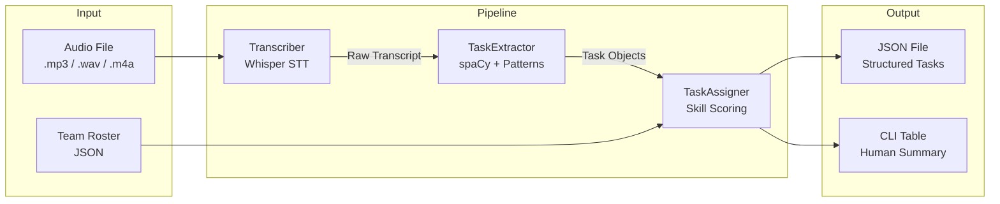
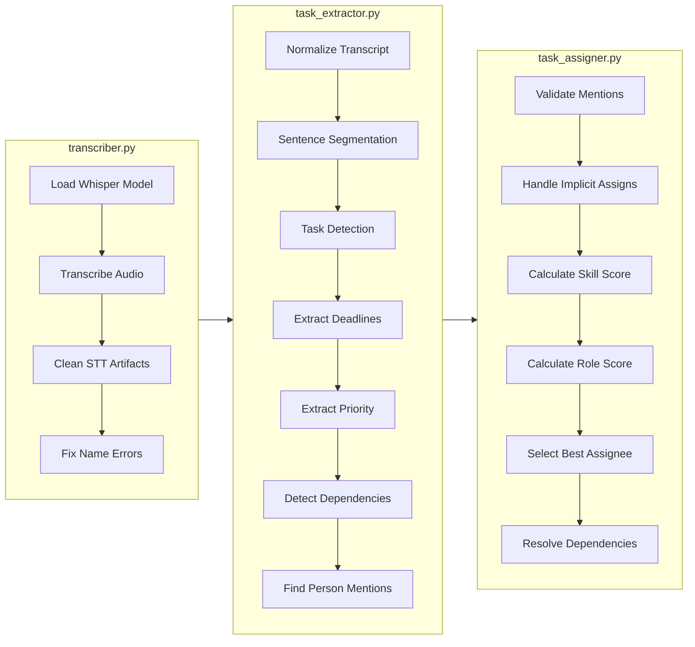

# Meeting Task Assignment System

**Converts meeting audio → structured, assigned task list using local Whisper + rule-based NLP.**


---

## Overview

A CLI tool that takes meeting audio and a team roster as input, then outputs:

- Extracted tasks with descriptions
- Auto-assigned owners (based on mentions, skills, roles)
- Parsed deadlines (natural language → ISO 8601)
- Priority levels
- Task dependencies

Runs entirely locally using OpenAI Whisper for transcription and custom regex patterns for task extraction.

---

## Architecture





### Module Responsibilities

| File                      | What it does                                                                               |
| ------------------------- | ------------------------------------------------------------------------------------------ |
| `main.py`               | CLI entry point, orchestrates pipeline, handles I/O                                        |
| `src/transcriber.py`    | Whisper wrapper, cleans STT artifacts (spaced letters, name errors)                        |
| `src/task_extractor.py` | Sentence segmentation, task detection via 50+ regex patterns, deadline/priority extraction |
| `src/task_assigner.py`  | Skill scoring, role matching, fuzzy name resolution, dependency linking                    |
| `src/models.py`         | `Task` and `TeamMember` dataclasses                                                    |

---

## Engineering Decisions

| Decision                                     | Why                                                                                                                                            |
| -------------------------------------------- | ---------------------------------------------------------------------------------------------------------------------------------------------- |
| **Rule-based NLP instead of LLMs**     | Predictable behavior, no API costs, works offline, fast. Meeting language is formulaic enough that patterns work.                              |
| **Local Whisper instead of cloud STT** | Privacy (meetings contain sensitive info), no per-minute billing, works without internet.                                                      |
| **Fuzzy name matching (rapidfuzz)**    | Whisper often mishears names ("Sakshi" → "Sokshi"). 65% threshold catches these without false positives.                                      |
| **spaCy for sentence splitting only**  | Robust sentence boundary detection. Task detection uses custom patterns because spaCy's NER doesn't understand "task assignment" as a concept. |
| **JSON output instead of database**    | Simplicity. Output is meant for integration with existing tools (Jira, Notion, etc.), not as a standalone app.                                 |
| **Dataclasses over dicts**             | Type safety, IDE autocomplete, cleaner code. Small overhead, major maintainability gain.                                                       |

---

## Features

- **Task filtering**: Ignores greetings, rhetorical questions, discussions. Extracts actionable statements.
- **Fuzzy name matching**: Corrects Whisper transcription errors ("Sokshi" → "Sakshi").
- **Deadline parsing**: "tomorrow evening", "before Friday's release" → ISO 8601 datetime.
- **Priority detection**: Keywords like "critical", "blocking", "ASAP" → priority levels.
- **Implicit assignment resolution**: "Someone from backend should handle this" → assigns to backend engineer.
- **Dependency linking**: "This depends on the login fix" → links task IDs.

---

## Tech Stack

| Tool                     | Purpose                                                                       |
| ------------------------ | ----------------------------------------------------------------------------- |
| **OpenAI Whisper** | Local speech-to-text. No API key needed after model caches (~140MB for base). |
| **spaCy**          | Sentence segmentation.`en_core_web_sm` model.                               |
| **rapidfuzz**      | Fast fuzzy string matching for name resolution.                               |
| **dateparser**     | Natural language → datetime conversion with timezone awareness.              |
| **FFmpeg**         | Required by Whisper to decode audio formats. System dependency.               |

---

## Input / Output

### Input

**Audio**: `.wav`, `.mp3`, `.m4a`

**Team roster** (`examples/sample_team.json`):

```json
{
  "team_members": [
    {
      "name": "Sakshi",
      "role": "Frontend Developer",
      "skills": ["React", "JavaScript", "UI bugs"]
    }
  ]
}
```

### Output

**JSON** (`tasks_output.json`):

```json
{
  "tasks": [
    {
      "id": 1,
      "task": "Fix checkout crash",
      "description": "we need someone to fix the checkout crash before Friday",
      "assigned_to": "Mohit",
      "deadline": "Friday",
      "deadline_iso": "2025-12-27T00:00:00+05:30",
      "priority": "High",
      "dependencies": [],
      "reason": "Skills: Database, APIs; Backend Engineer matches task type"
    }
  ]
}
```

**CLI table** (printed to stdout):

```
#   Task                        Assigned To     Deadline        Priority
--------------------------------------------------------------------------------
1   Fix checkout crash          Mohit           Friday          High
2   Handle login bug            Sakshi          Tomorrow        Critical
```

---

## How to Run

### Prerequisites

```bash
# Install FFmpeg (required for Whisper)
# Windows: choco install ffmpeg
# Mac: brew install ffmpeg
# Linux: sudo apt install ffmpeg
```

### Setup

```bash
git clone <repo>
cd meeting-task-assignment
python -m venv venv
source venv/bin/activate  # Windows: venv\Scripts\activate
pip install -r requirements.txt
python -m spacy download en_core_web_sm
```

### Run

```bash
# Basic usage
python main.py --audio examples/meeting.mp3 --team examples/sample_team.json --output tasks.json

# With different Whisper model (tiny/base/small/medium/large)
python main.py -a examples/meeting.mp3 -t examples/sample_team.json -m small

# Help
python main.py -h
```

---

## Repository Structure

```
meeting-task-assignment/
├── src/                      # Source code
│   ├── __init__.py           # Package exports
│   ├── transcriber.py        # Whisper wrapper + STT cleanup
│   ├── task_extractor.py     # NLP patterns + extraction logic
│   ├── task_assigner.py      # Assignment scoring + matching
│   └── models.py             # Task, TeamMember dataclasses
├── examples/                 # Sample files for testing
│   ├── meeting.mp3           # Sample meeting audio
│   ├── sample_team.json      # Team configuration
│   └── sample_output.json    # Example output
├── main.py                   # CLI entry point
├── architecture.png          # System diagram
├── requirements.txt          # Python dependencies
├── LICENSE                   # MIT
└── README.md
```

---

## Limitations

- **Audio quality dependent**: Whisper accuracy drops with heavy accents, crosstalk, or poor microphones.
- **English only**: spaCy model and regex patterns are English-specific.
- **No speaker diarization**: Cannot identify who said what. Relies on text cues.
- **Pattern coverage**: Novel phrasing may not match existing regex patterns.
- **CPU-bound**: Whisper on CPU: ~1 min audio ≈ 30 sec processing (base model).
- **Static rules**: Does not learn or improve from corrections.

---

## Future Improvements

- [ ] Add speaker diarization (pyannote.audio) to attribute statements to speakers
- [ ] GPU acceleration for Whisper (significant speedup for long meetings)
- [ ] Confidence scores per task with human review flags
- [ ] Export to Jira/Trello/Notion via their APIs
- [ ] Web UI for non-technical users
- [ ] Multi-language support (swap spaCy model + translate patterns)

---

## License

[MIT License](LICENSE)
