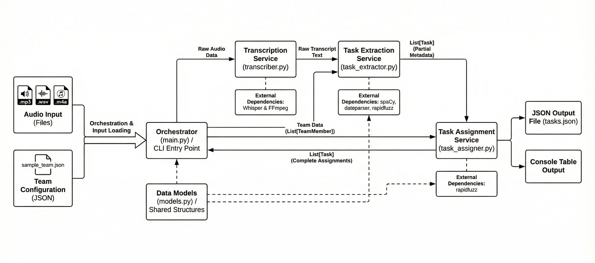

# Meeting Task Assignment System


Transforms raw meeting audio into structured, auto-assigned task lists using local Whisper transcription and rule-based NLP.

## Problem Statement
Teams leave meetings with fuzzy notes, missed owners, and unclear deadlines, forcing manual transcription, task extraction, and coordination that slows delivery and creates accountability gaps.

## Solution Overview
This system ingests meeting audio, transcribes it locally via Whisper, parses the transcript with custom NLP rules to detect actionable work, and intelligently assigns each task to the best-fit team member before exporting a review-ready JSON file and console table.

## Architecture Diagram


## Architecture Explanation
- **Audio Ingestion & Validation**: `main.py` verifies file type (`.wav`, `.mp3`, `.m4a`) and prepares run metadata.
- **Speech-to-Text Module**: `transcriber.py` loads the selected Whisper model and produces a cleaned transcript.
- **Sentence Segmentation & Normalization**: `task_extractor.py` normalizes punctuation, splits sentences with spaCy, and filters non-actionable chatter.
- **Task Extraction Engine**: Pattern libraries detect task verbs, deadlines, priorities, dependencies, and person mentions; matched snippets become `Task` objects.
- **Assignment Engine**: `task_assigner.py` keeps direct mentions, resolves “someone” phrases by role, then scores skills/roles to pick the best owner and link dependencies.
- **Output Formatter**: `main.py` prints a CLI table for humans and serializes structured JSON via `Task.to_dict()` for downstream systems.

## Key Features
- Local Whisper-powered speech-to-text (no API keys once models cached).
- Rule-based NLP task extraction with deadline, priority, and dependency parsing.
- Skill-, role-, and mention-aware task assignment for transparent ownership.
- JSON export plus CLI table summary for instant review.
- Configurable Whisper model sizes for speed vs. accuracy trade-offs.

## Tech Stack (With Purpose)
- **Python 3.8+**: Primary runtime orchestrating the pipeline.
- **OpenAI Whisper (via `whisper` library)**: Offline transcription of meeting audio.
- **spaCy (`en_core_web_sm`)**: Sentence segmentation and linguistic features for task detection.
- **dateparser**: Converts natural language deadlines (“next Friday”) into normalized values.
- **rapidfuzz**: Fuzzy name matching to handle transcription errors in person mentions.
- **FFmpeg**: Required by Whisper to decode assorted audio formats.

## System Workflow (Chronological Processing Steps)
1. Validate CLI arguments and input files.
2. Load team roster from JSON into `TeamMember` dataclasses.
3. Transcribe audio to text using the selected Whisper model.
4. Normalize transcript, split sentences, and detect actionable statements.
5. Extract deadlines, priorities, dependencies, and referenced people.
6. Instantiate `Task` objects and run assignment logic to pick owners.
7. Print a formatted CLI table for quick inspection.
8. Persist tasks to `tasks_output.json` (or custom path) for integrations.

## Input Format
- **Audio**: `.wav`, `.mp3`, or `.m4a`. Other formats are rejected early with a helpful message.
- **Team JSON** (`sample_team.json` template):
  ```json
  {
    "team_members": [
      {
        "name": "Sakshi",
        "role": "Frontend Developer",
        "skills": ["React", "JavaScript", "UI bugs"]
      }
    ]
  }
  ```

## Output Format
- **JSON** (`tasks_output.json` by default):
  ```json
  {
    "tasks": [
      {
        "id": 1,
        "task": "Fix login bug",
        "description": "We need to fix the login bug before Friday's release.",
        "assigned_to": "Sakshi",
        "deadline": "Friday evening",
        "deadline_iso": "2025-05-09T18:00:00+05:30",
        "priority": "High",
        "dependencies": [],
        "reason": "Skills: React, UI bugs"
      }
    ]
  }
  ```
- **Console Table** (auto-printed by `main.py`):
  ```
  #   Task                             Assigned To     Deadline             Priority
  ------------------------------------------------------------------------------------
  1   Fix login bug                   Sakshi          Friday evening       High
  ```

## Example Input & Example Output
- **Transcript Snippet**
  ```
  “Team, we need someone to fix the checkout crash before Friday. Sakshi, please handle the login bug regression by tomorrow evening.”
  ```
- **Resulting JSON**
  ```json
  {
    "tasks": [
      {
        "id": 1,
        "task": "Fix checkout crash",
        "description": "we need someone to fix the checkout crash before Friday",
        "assigned_to": "Mohit",
        "deadline": "Friday",
        "priority": "High",
        "dependencies": [],
        "reason": "Skills: Database, APIs"
      },
      {
        "id": 2,
        "task": "Handle login bug regression",
        "description": "Sakshi, please handle the login bug regression by tomorrow evening",
        "assigned_to": "Sakshi",
        "deadline": "Tomorrow evening",
        "priority": "Critical",
        "dependencies": [],
        "reason": "Directly mentioned in meeting"
      }
    ]
  }
  ```
- **Formatted Table**
  ```
  #   Task                             Assigned To     Deadline             Priority
  ------------------------------------------------------------------------------------
  1   Fix checkout crash              Mohit           Friday               High
  2   Handle login bug regression     Sakshi          Tomorrow evening     Critical
  ```

## Installation Instructions
1. Install FFmpeg (e.g., `choco install ffmpeg`, `brew install ffmpeg`, or `sudo apt install ffmpeg`).
2. Clone the repo and create a virtual environment:
   ```
   python -m venv venv
   venv\Scripts\activate  # Windows
   source venv/bin/activate  # macOS/Linux
   ```
3. Install dependencies:
   ```
   pip install -r requirements.txt
   python -m spacy download en_core_web_sm
   ```

## How to Run
1. **Transcribe + Extract + Assign in one command**
   ```
   python main.py --audio meeting.mp3 --team sample_team.json --output tasks.json
   ```
2. **Specify Whisper model for accuracy/speed trade-off**
   ```
   python main.py -a meeting.mp3 -t sample_team.json -m small
   ```
3. **Preview help/options**
   ```
   python main.py -h
   ```

## Folder Structure
```
task/
├── main.py               # CLI orchestrator
├── transcriber.py        # Whisper wrapper
├── task_extractor.py     # NLP task extraction
├── task_assigner.py      # Assignment logic
├── models.py             # Dataclasses
├── sample_team.json      # Template team config
├── requirements.txt      # Python deps
├── meeting.mp3           # Sample audio
└── README.md             # This document
```

## Limitations
- Whisper transcription quality depends on audio clarity and may mis-hear niche names.
- Rule-based NLP can miss highly informal phrasing or novel task wording.
- No built-in diarization; speaker identification relies solely on text cues.
- Runs on CPU by default, so long recordings can take several minutes.
- Currently single-language focus (English) aligned with the shipped spaCy model.

## License
[MIT License](LICENSE)

